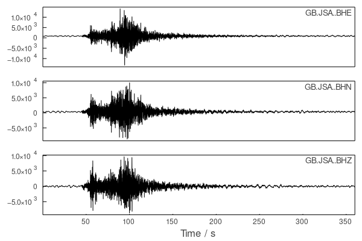

# SeisRequests

Gather seismic data and metadata from web services using Julia.

[](https://github.com/anowacki/SeisRequests.jl/actions)
[](https://codecov.io/gh/anowacki/SeisRequests.jl)

## About SeisRequests

SeisRequests allows you to easily create and submit a request for seismic data
to any server round the world which supports either the FDSN
or IRIS web services specifications.  Examples include [IRIS](https://iris.edu)
itself and the EU's data repository [Orfeus](https://www.orfeus-eu.org).

You can search for seismic waveform data, earthquake locations and station
information amongst other things.

## Installing

Add SeisRequests like so:

```julia
julia> ] # Type ']' to enter pkg mode

pkg> add https://github.com/anowacki/Geodesics.jl https://github.com/anowacki/Seis.jl https://github.com/anowacki/SeisRequests.jl
```

SeisRequests supports the latest
[long-term support release of Julia](https://julialang.org/downloads/#long_term_support_release),
requiring v1.6 or newer.

## Using

### High-level interface
If you just want to get earthquake parameters, station metadata or raw
seismic data, use the high-level interface, which offers three main
functions:
- `get_events`, to return `Seis.Event`s with information about seismic
  events in various catalogues.
- `get_stations`, to return `Seis.Station`s with metadata about seismic
  sensors.
- `get_data`, to return `Seis.Trace`s with raw seismic data.

Each of these accept keyword arguments to define the region of interest
in which to search for the events or stations.  For details of all keywords
which can be used, see the docstrings for `FDSNEvent`, `FDSNStation` and
`FDSNDataSelect`.

#### Servers
SeisRequests knows about some servers with which it can communicate.  To
see the list, call `SeisRequests.server_list()`.

The server can be specified by either the server key (from `server_list`)
or a full URL (like `"http://service.iris.edu"`) using the `server`
keyword argument to the `get_*` functions.

#### Example
For example, let's try and find some data for the [Cwmllynfell event in
South Wales on 17 February 2018](http://www.earthquakes.bgs.ac.uk/earthquakes/recent_events/20180217142554.html#page=summary):

```julia
julia> using SeisRequests, Dates

julia> origintime = DateTime(2018, 02, 17, 14, 31, 06);

julia> event = get_events(starttime=origintime-Second(10), endtime=origintime+Second(10), minmagnitude=4) |> first
Seis.Event{Float64,Seis.Geographic{Float64}}:
        lon: -3.8936
        lat: 51.7074
        dep: 10.42
       time: 2018-02-17T14:31:04.750
         id: smi:service.iris.edu/fdsnws/event/1/query?originid=28547804
       meta: type => "earthquake"
             quakeml => QuakeML.Event
  description: Array{QuakeML.EventDescription}((1,))
  comment: Array{QuakeML.Comment}((0,))
  focal_mechanism: Array{QuakeML.FocalMechanism}((0,))
  amplitude: Array{QuakeML.Amplitude}((0,))
  magnitude: Array{QuakeML.Magnitude}((1,))
  station_magnitude: Array{QuakeML.StationMagnitude}((0,))
  origin: Array{QuakeML.Origin}((1,))
  pick: Array{QuakeML.Pick}((0,))
  preferred_origin_id: QuakeML.ResourceIdentifier
  preferred_magnitude_id: QuakeML.ResourceIdentifier
  preferred_focal_mechanism_id: Missing missing
  type: QuakeML.EventType
  type_certainty: Missing missing
  creation_info: Missing missing
  public_id: QuakeML.ResourceIdentifier

             author => "us"
             mag_type => "mb"
             mag_author => "us"
             mag => 4.3
             description => "UNITED KINGDOM (Flinn-Engdahl region)"
             server => "IRIS"
```

Now let's get the metadata about the station [JSA](http://www.earthquakes.bgs.ac.uk/data/station_book/stationbook_jsa.html)
if it was active at the time:

```julia
julia> stations = get_stations(event, code="GB.JSA.*.BH?")
[ Info: Request status: Successful request, results follow
3-element Vector{GeogStation{Float64}}:
 Station: GB.JSA..BHE, lon: -2.171698, lat: 49.187801, dep: 0.0, elev: 39.0, azi: 90.0, inc: 90.0, meta: 4 keys
 Station: GB.JSA..BHN, lon: -2.171698, lat: 49.187801, dep: 0.0, elev: 39.0, azi: 0.0, inc: 90.0, meta: 4 keys
 Station: GB.JSA..BHZ, lon: -2.171698, lat: 49.187801, dep: 0.0, elev: 39.0, azi: 0.0, inc: 0.0, meta: 4 keys
```

If we want to get some data from here, we can ask how long before and
after the earthquake we want, then finally submit a request for some data.
In this case, let's ask for data starting 0 s (`Second(0)`) before and
300 s (`Minute(6)`) after the earthquake.

```julia
julia> data = get_data(event, stations, Second(0), Minute(6))
[ Info: Request status: Successful request, results follow
3-element Vector{Trace{Float64, Vector{Float64}, Seis.Geographic{Float64}}}:
 Seis.Trace(GB.JSA..BHE: delta=0.02, b=0.015, nsamples=18000)
 Seis.Trace(GB.JSA..BHN: delta=0.02, b=0.005, nsamples=18000)
 Seis.Trace(GB.JSA..BHZ: delta=0.02, b=0.015, nsamples=18000)
```

If we have Plots installed, we can now look at our lovely data!

```julia
julia> using Seis.Plot, Plots

julia> plot(data)
```



To request data windows based on predicted seismic travel times, install
[SeisTau.jl](https://github.com/anowacki/SeisTau.jl); see the docstring
for `get_data` for details.


### Low-level interface
The high-level functions work by calling the low-level interface, which
operates in this way:
1. Create a request using a constructor:
  - Using the FDSN Web Services standard:
    - `FDSNEvent`: Query for events
    - `FDSNStation`: Look for stations
    - `FDSNDataSelect`: Request waveform data
  - Using the IRIS Web Services standard:
    - `IRISTimeSeries`: Request waveform data with preprocessing done
3. Send that request to your preferred server with `get_request`, and
   get back a `HTTP.Message.Response`, containing the raw response in the
   `.body` field.
4. Process the raw output as needed.

Each of the constructors has comprehensive documentation you can access
in the REPL by typing, e.g., `?FDSNEvent`.

